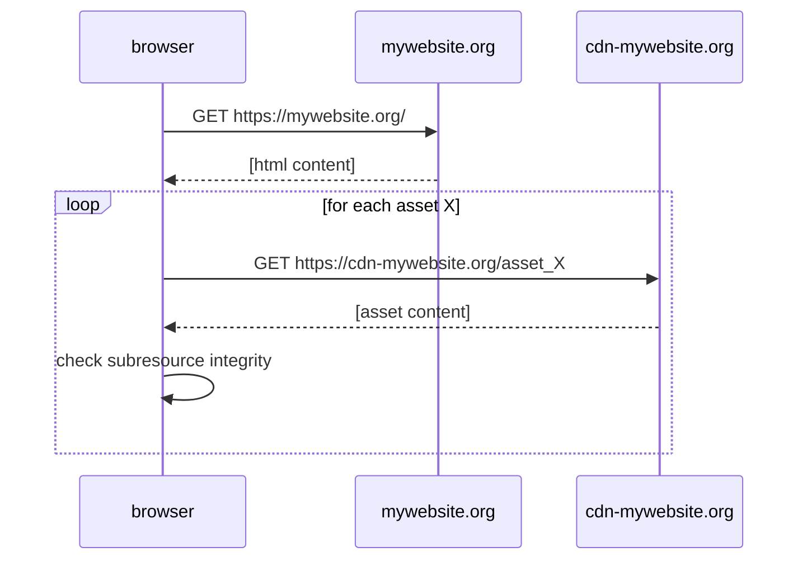
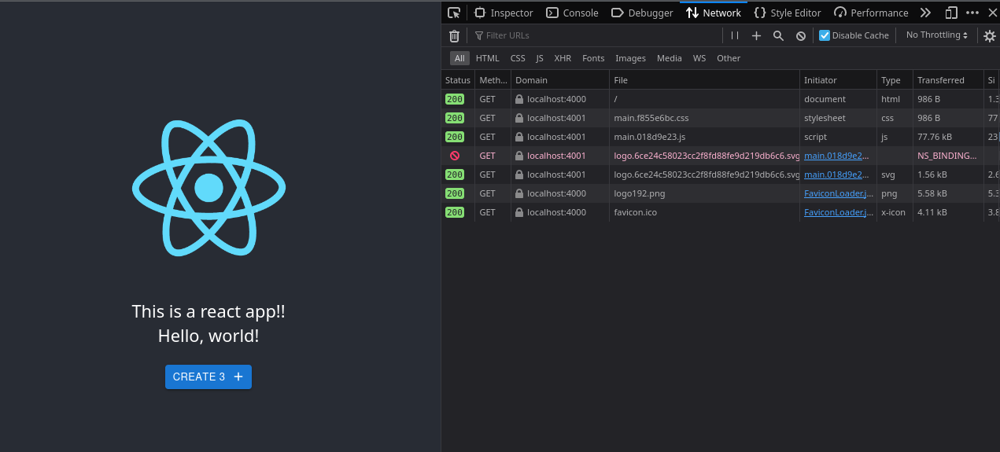

# Protect your CDN against MITM attacks

HTTPS does not protect you anymore from MITM. Read [here](https://blog.quadristan.fr/posts/2024-03-these-companies-have-broken-https/) why!

Do you want to make your distributed react app safe on your CDN?
Here is how

## The infrastructure

You need:

- Your own domain. Ex: `mywebsite.org`
- A separate domain for your CDN. Ex: `cdn-mywebsite.org`. It does not need to be human usable. If your CDN provides you with a long boring domain name use it. What matters is that it stays stable.



## Running the sample

In the sample, the website origin is `http://localhost:4000` and the CDN origin is `http://localhost:4001`.
For fun, there is also a backend at `http://localhost:4002`

```bash
docker compose build && docker compose up
firefox http://localhost:4000 # Or whatever your browser is!
```

You will see in the network queries, that the big files are obtained from the CDN:



## Understanding this sample:

- `react-app-rewired` is used to configure webpack
- `csp-html-webpack-plugin` is used to inject strict CSP to prevent your subresources from being lax
- `webpack-subresource-integrity` is used to inject subresource integrity verification in the html pages

The sample uses material-ui just for fun, and to let you check a real example with complex scripts
